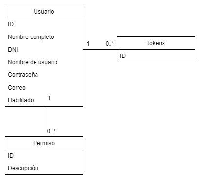

# Enunciado general del TP:

En resumen se trata de un sistema de administración de "tokens", que permite transacciones entre usuarios de una moneda virtual sin valor real. Este sistema puede usarse tanto de manera lúdica como seria (algunos ejemplos serían usarlo como programa de recompensas de alguna tienda o como administración de puntaje de alguna dinámica informal).

[Sistema de Tokens](tokenizate.com.ar)

## ABMC
- Usuario
  - Nombre completo
  - Nombre de usuario
  - Contraseña
  - Correo
  - DNI
  - Habilitado
## ABMC dependiente
- Tokens
  - Dueño (Usuario)
## Listado simple
- Tipos de tokens para enviar
## Listado complejo
- Personas para enviar token (filtrado en backend)
- Filtra por nombre, nick o DNI
## Detalle
- Usuario y permisos
- Por ID de usuario o por ID de permiso.
## Equipo
Santiago Abud - legajo 47015
## Modelo de dominio
 
## Tecnologías:
- NodeJS
- Express
- Angular
- MySQL
- Sequelize
- FW CSS [Chota](https://jenil.github.io/chota/)

### 1.2 - Funcionalidad

1 de cada uno:

|Requerimiento funcional|Descripcion|Cumple?|
|:-|:-|-|
|ABMC simple|Usuario|:heavy_check_mark:
|ABMC dependiente|Tokens|:heavy_check_mark:
|Listado simple|Tipos de tokens|
|Listado complejo obligatorio|Personas|
|Detalle básico|Usuario y permisos|

